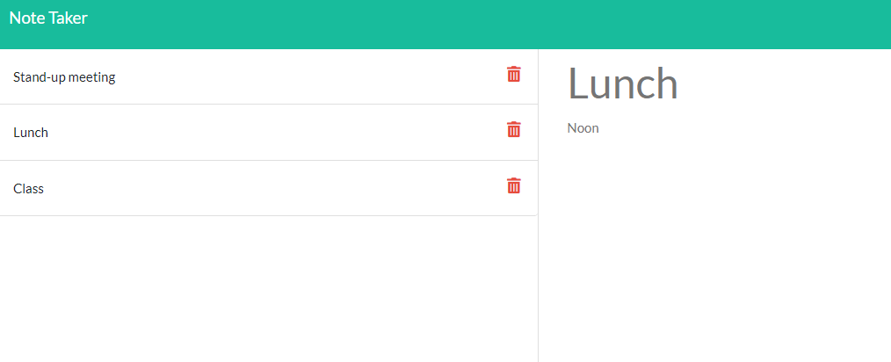

# Note Taker
  

  ## Description
  
  A note taking app which allows the addition and removal of custom notes that persist on the server.
  
  ## Table of Contents (Optional)
  
  * [Installation](#installation)
  * [Usage](#usage)
   
  * [Contribute](#contributing)
  * [Testing](#testing)
  * [Questions](#questions)
  
  ## Installation
  
  To install necessary dependencies, run the following command: 

  npm i

  ## Usage

  https://shielded-tor-02263.herokuapp.com/notes
  

  
  ## How to Contribute
  
  nothing

  ## Testing
  
  To run tests, run the following command:

  npm test
  
  ## Questions
  
  If you have any questions about the repo, open an issue or contact me directly at bourpower@gmail.com. You can find more of my work at [SBour1](https://github.com/SBour1/).
  

